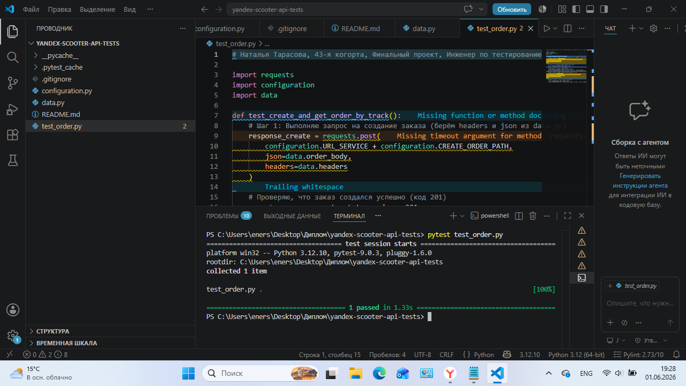

# Дипломный проект: Тестирование API и Базы Данных Яндекс Самокат 🛴

Проект содержит автоматизированный интеграционный тест для валидации бэкенда API, а также решения практических задач по работе с СУБД PostgreSQL.

---

## 🤖 Автоматизация API-теста (Python)

В проекте реализован автоматический тест для валидации сквозного сценария работы с заказами.

### Сценарий автотеста:
1. Выполняется POST-запрос на создание нового заказа в системе.
2. Из ответа сервера динамически извлекается и сохраняется  номер трека заказа (`track`).
3. Выполняется GET-запрос на получение детальной информации о заказе по сохранённому трек-номеру.
4. Проверяется, что код ответа от сервера равен **200 OK**.

### Инструменты в проекте:
* **Язык программирования:** Python 3.12
* **Библиотека запросов:** `requests`
* **Тестовый фреймворк:** `pytest`

### Инструкция по запуску:
1. Установка необходимых библиотек:
   ```bash
   pip install requests pytest
   ```
2. Команда для запуска автотеста с выводом логов в консоль:
   ```bash
   pytest test_order.py -v -s
   ```

---

## 📋 Выполненные задачи по базам данных (SQL)

В рамках работы также были настроены подключения к PostgreSQL через DBeaver и проверены следующие сценарии:
1. **Задание 1:** Вывод списка логинов курьеров с количеством их заказов в статусе «В доставке» (`inDelivery = true`). *(В ходе теста был подтвержден UI/Бэкенд дефект с дублированием заказов во вкладке «Мои»)*.
2. **Задание 2:** Валидация статусов заказов с использованием конструкции `CASE WHEN`.

### 📸 Результат запуска автотеста:

